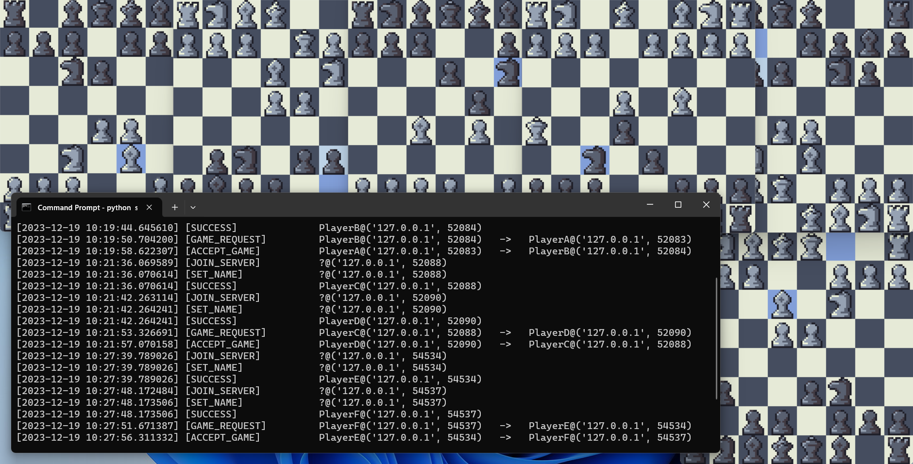

### Chess-Sim

* [Introduction](#introduction)
* [License](#license)
* [Dependencies](#dependencies)
* [Administration](#administration)
* [Challenges and Limitations](#challenges-and-limitations)

### Introduction
Chess-Sim is a hobby project I undertook to familiarise myself with multi-processing and network programming. Chess-Sim emulates
chess-based social networking sites, albeit in a much simpler format. The project hybridises client-to-server and
peer-to-peer network architectures, with central servers establishing peer-to-peer connections between users to transfer chess moves
within the context of a current game.



Chess-Sim is a simulation. It uses IPC calls on the local host to emulate RPC calls in a deployed environment. Although Chess-Sim is just
a hobby project, it could easily be deployed by replacing hard-coded loopback addresses with that of a host server, and routing user 
traffic through it.

### License

All code is open-source, licensed under the MIT license, with the exception of the chess piece game assets, sourced from
https://dani-maccari.itch.io/pixel-chess attributed to DANI MACCARI and licensed under CC-BY-ND. 

See [License.txt](./LICENSE.txt) for more details.

### Dependencies
Chess-Sim is implemented in python using pygame with built-in socket and threading libraries. To run, ensure that the following requirements
are first met:
* [Python version 3.8+](https://www.python.org/downloads/)
* [Pygame version 2.5.0+](https://pypi.org/project/pygame/2.5.0/)

### Administration
To run the application, first spin-up the server, and then instantiate a number of player processes. 
```
    python app/server_app.py
```
```
    python app/app.py
```
This will attach the server to the current shell and log all server events as they are processed.
A game can be created within the command-line context of the instantiated players: 
```
    Enter username: Player1
    Input command: Game Request Received, press enter to process: 

    Incoming-request from Player2. Type "Accept" or "Reject": accept
    Input command: Request Accepted. Press Enter to start game.
```
```
    Enter username: Player2
    Input command: request Player1
    Input command: Request Accepted. Press Enter to start game.
```
The command-line context will be re-entered upon termination of the initialised game, at which point the player can select a new game with
another player or leave the server. 

Typing help into the command-line will list all available server requests.

### Challenges and Limitations

An obstacle I faced during the development of this project was the handling of exceptions within threads. 
In server runtime, a main thread listens for user input while a thread pool executes tasks submitted by each of its many 
client connections. These clients also listen for user input via a main thread and handle their server or opponent facing
context separately within a handling thread. Thus, most software executes outside the main thread, complicating the process of exception handling.

Another obstacle faced was the complexity introduced from hybridising peer-to-peer and client-server architectures. The following is
an example of how the network exchange between connected opponents differs depending on whether a player exists within the context of the
player requesting or accepting the opponent connection.
```
def terminate_game(self):
    if self.opponent_connection:
        self.opponent_connection.send(pickle.dumps((RequestType.TERMINATE_GAME, None)))
    else:
        self.opponent_socket.send(pickle.dumps((RequestType.TERMINATE_GAME, None)))

def ack_termination(self):
    if self.opponent_connection:
        self.opponent_connection.send(pickle.dumps((RequestType.TERMINATE_GAME_ACK, None)))
    else:
        self.opponent_socket.send(pickle.dumps((RequestType.TERMINATE_GAME_ACK, None)))
```
If the project were to be adapted into an actual distributed chess ecosystem, the application would be better implemented as a traditional
web-dev stack with client-server exchange only, or as a P2P network interfaced with by a Desktop Application tailored towards a given OS.